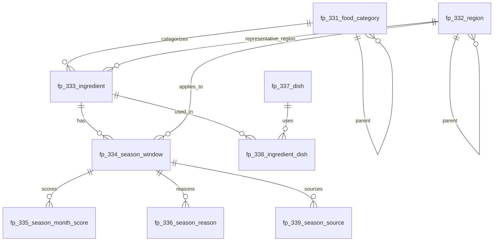

# 제철음식 서버 측 공유문서

문서 버전: 0.1  
대상 범위: `fp_330` ~ `fp_339`  
DB 기준: PostgreSQL  
목적: 제철음식 앱에서 식재료와 제철 정보를 월 단위로 관리하고, 사용자에게 “왜 지금 먹기 좋은지”를 설명할 수 있는 데이터 구조를 서버 측에서 공유한다.

---

## 1. 설계 방향

제철음식은 `몇 월이면 제철이다 / 아니다`로 자르면 정확도가 떨어진다.  
따라서 이 구조는 제철을 다음과 같이 관리한다.

```text
식재료
→ 지역
→ 제철 기간
→ 월별 제철 점수
→ 제철 이유
→ 활용 요리
→ 근거 출처
```

핵심 원칙은 다음과 같다.

1. 식재료와 요리명을 분리한다.
2. 제철 기간은 식재료의 고정 속성이 아니라 별도 관계 데이터로 둔다.
3. 월별 제철 여부는 boolean이 아니라 `0~100 점수`로 관리한다.
4. 제철 이유를 별도 테이블로 분리하여 설명 가능한 데이터로 만든다.
5. 지역과 출처를 남겨 데이터 신뢰도를 추적한다.

---

## 2. 테이블 번호 규칙

| 번호 | 테이블명 | 이름 | 역할 |
|---:|---|---|---|
| 330 | `fp_330_code` | 공통 코드 | 제철 유형, 이유, 신뢰도, 지역 유형, 요리 방식 등 서비스 공통 코드를 관리한다. |
| 331 | `fp_331_food_category` | 식재료 분류 | 농산물, 수산물, 과일류, 어류, 패류 등 홈 필터와 탐색 트리를 구성한다. |
| 332 | `fp_332_region` | 지역 마스터 | 전국, 시도, 시군구, 산지, 해역 단위의 지역별 제철 차이를 표현한다. |
| 333 | `fp_333_ingredient` | 식재료 마스터 | 참외, 굴, 방어처럼 원재료 단위의 기본 정보를 관리한다. |
| 334 | `fp_334_season_window` | 제철 기간 | 식재료가 어느 지역에서 어떤 유형으로 몇 월부터 몇 월까지 제철인지 정의한다. |
| 335 | `fp_335_season_month_score` | 월별 제철 점수 | 월별 제철도를 0~100 점수로 관리하여 추천 정렬과 절정 배지를 만든다. |
| 336 | `fp_336_season_reason` | 제철 이유 | 당도 상승, 지방 증가, 수확량 증가 등 제철로 판단하는 이유를 다중 관리한다. |
| 337 | `fp_337_dish` | 요리 마스터 | 참외화채, 감자전, 굴국밥, 방어회 같은 활용 요리를 관리한다. |
| 338 | `fp_338_ingredient_dish` | 식재료-요리 매핑 | 식재료와 요리의 다대다 관계를 관리하고 대표 요리와 추천 월을 표시한다. |
| 339 | `fp_339_season_source` | 근거 출처 | 공공자료, 산지자료, 전문가 검수 등 제철 데이터의 출처와 확인일을 관리한다. |

---

## 3. 관계 구조



---

## 4. 테이블 상세

### 330. `fp_330_code` - 공통 코드

제철 유형, 이유, 신뢰도, 지역 유형, 요리 방식 등 서비스 공통 코드를 관리한다.

| 컬럼 | 타입 | 설명 |
|---|---|---|
| `code_group` | `VARCHAR(50) NOT NULL` | 코드 그룹. 예: SEASON_TYPE, REASON, CONFIDENCE, REGION_TYPE, COOKING_TYPE. |
| `code` | `VARCHAR(50) NOT NULL` | 코드 값. 서버와 클라이언트가 주고받는 안정적인 식별자다. |
| `code_nm` | `VARCHAR(100) NOT NULL` | 사용자 또는 관리자가 읽을 수 있는 코드명. |
| `description` | `TEXT` | 해당 코드의 의미, 적용 기준, 사용 예시를 설명한다. 관리 화면에서 혼동을 줄이는 주석 역할도 한다. |
| `sort_order` | `INTEGER NOT NULL DEFAULT 0` | 동일 코드 그룹 안에서 노출 순서를 제어한다. |
| `use_yn` | `CHAR(1) NOT NULL DEFAULT 'Y'` | 사용 여부. N이면 기존 데이터 보존용으로만 남기고 신규 입력에는 사용하지 않는다. |
| `created_at` | `TIMESTAMPTZ NOT NULL DEFAULT NOW()` | 최초 등록 일시. |
| `updated_at` | `TIMESTAMPTZ` | 마지막 수정 일시. 애플리케이션 또는 트리거에서 갱신한다. |

### 331. `fp_331_food_category` - 식재료 분류

농산물, 수산물, 과일류, 어류, 패류 등 홈 필터와 탐색 트리를 구성한다.

| 컬럼 | 타입 | 설명 |
|---|---|---|
| `category_id` | `VARCHAR(30) NOT NULL` | 분류 ID. 예: CAT_AGRI, CAT_SEAFOOD, CAT_FRUIT. |
| `parent_category_id` | `VARCHAR(30)` | 상위 분류 ID. NULL이면 최상위 분류다. |
| `category_nm` | `VARCHAR(100) NOT NULL` | 분류명. 사용자 화면에 노출될 수 있는 이름이다. |
| `category_level` | `SMALLINT NOT NULL` | 분류 깊이. 1은 대분류, 2는 중분류, 3 이상은 세분류로 사용한다. |
| `category_type_cd` | `VARCHAR(50) NOT NULL DEFAULT 'INGREDIENT'` | 분류 용도 코드. 기본은 식재료 분류이며, 향후 요리 분류 등으로 확장할 수 있다. |
| `description` | `TEXT` | 분류의 범위와 포함 기준을 설명한다. 예: 과일류는 서비스 정책상 과일로 노출하는 항목을 포함한다. |
| `sort_order` | `INTEGER NOT NULL DEFAULT 0` | 동일 레벨에서의 노출 순서. |
| `use_yn` | `CHAR(1) NOT NULL DEFAULT 'Y'` | 사용 여부. |
| `created_at` | `TIMESTAMPTZ NOT NULL DEFAULT NOW()` | 최초 등록 일시. |
| `updated_at` | `TIMESTAMPTZ` | 마지막 수정 일시. |

### 332. `fp_332_region` - 지역 마스터

전국, 시도, 시군구, 산지, 해역 단위의 지역별 제철 차이를 표현한다.

| 컬럼 | 타입 | 설명 |
|---|---|---|
| `region_id` | `VARCHAR(30) NOT NULL` | 지역 ID. 예: REG_ALL, REG_JEJU, REG_SEONGJU, REG_SOUTH_SEA. |
| `parent_region_id` | `VARCHAR(30)` | 상위 지역 ID. NULL이면 최상위 지역이다. |
| `region_nm` | `VARCHAR(100) NOT NULL` | 지역명. 사용자 화면의 지역 필터나 상세 정보에 노출된다. |
| `region_type_cd` | `VARCHAR(50) NOT NULL` | 지역 유형 코드. 예: COUNTRY, PROVINCE, CITY, SEA_AREA, ORIGIN. |
| `description` | `TEXT` | 지역의 적용 범위와 데이터 해석 기준. 예: 남해는 행정구역이 아니라 수산물 해역 기준으로 사용한다. |
| `sort_order` | `INTEGER NOT NULL DEFAULT 0` | 지역 목록 노출 순서. |
| `use_yn` | `CHAR(1) NOT NULL DEFAULT 'Y'` | 사용 여부. |
| `created_at` | `TIMESTAMPTZ NOT NULL DEFAULT NOW()` | 최초 등록 일시. |
| `updated_at` | `TIMESTAMPTZ` | 마지막 수정 일시. |

### 333. `fp_333_ingredient` - 식재료 마스터

참외, 굴, 방어처럼 원재료 단위의 기본 정보를 관리한다.

| 컬럼 | 타입 | 설명 |
|---|---|---|
| `ingredient_id` | `VARCHAR(30) NOT NULL` | 식재료 ID. 예: ING_CHAMOE, ING_GUL. 외부 노출보다는 내부 식별자로 사용한다. |
| `ingredient_nm` | `VARCHAR(100) NOT NULL` | 식재료명. 사용자에게 노출되는 기본 이름이다. |
| `ingredient_alias` | `VARCHAR(300)` | 별칭 또는 검색 보조어. 쉼표로 구분한다. 예: 석화, 생굴. |
| `category_id` | `VARCHAR(30) NOT NULL` | 식재료 분류 ID. fp_331_food_category를 참조한다. |
| `representative_region_id` | `VARCHAR(30)` | 대표 산지 또는 대표 지역. 식재료 카드에서 보조 정보로 사용한다. |
| `description` | `TEXT` | 식재료 소개 설명. 상세 화면의 첫 문단 또는 관리용 설명으로 사용한다. |
| `storage_tip` | `TEXT` | 보관 팁. 식재료 상세 화면에서 선택적으로 노출한다. |
| `thumbnail_url` | `VARCHAR(500)` | 대표 이미지 URL. CDN 또는 파일 서버 경로를 저장한다. |
| `search_keywords` | `VARCHAR(500)` | 검색 키워드. 이름, 별칭, 산지, 대표 요리 등 검색 품질을 높이기 위한 보조 문자열이다. |
| `sort_order` | `INTEGER NOT NULL DEFAULT 0` | 식재료 목록 기본 노출 순서. |
| `use_yn` | `CHAR(1) NOT NULL DEFAULT 'Y'` | 사용 여부. |
| `created_at` | `TIMESTAMPTZ NOT NULL DEFAULT NOW()` | 최초 등록 일시. |
| `updated_at` | `TIMESTAMPTZ` | 마지막 수정 일시. |

### 334. `fp_334_season_window` - 제철 기간

식재료가 어느 지역에서 어떤 유형으로 몇 월부터 몇 월까지 제철인지 정의한다.

| 컬럼 | 타입 | 설명 |
|---|---|---|
| `season_id` | `VARCHAR(30) NOT NULL` | 제철 기간 ID. 하나의 식재료가 지역, 성별, 크기, 제철 유형별로 여러 제철 기간을 가질 수 있다. |
| `ingredient_id` | `VARCHAR(30) NOT NULL` | 식재료 ID. fp_333_ingredient를 참조한다. |
| `region_id` | `VARCHAR(30) NOT NULL DEFAULT 'REG_ALL'` | 제철 기간이 적용되는 지역 ID. 전국 공통이면 REG_ALL을 사용한다. |
| `season_type_cd` | `VARCHAR(50) NOT NULL` | 제철 유형 코드. 예: TASTE, PRODUCTION, PRICE, CULTURE, TASTE_PRODUCTION. |
| `start_month` | `SMALLINT NOT NULL` | 제철 시작 월. 1부터 12까지 사용한다. 해를 넘기는 경우 start_month가 end_month보다 클 수 있다. |
| `end_month` | `SMALLINT NOT NULL` | 제철 종료 월. 예: 굴 11월부터 3월까지는 start_month=11, end_month=3으로 저장한다. |
| `peak_month_text` | `VARCHAR(50)` | 절정월 표시 문자열. 단일 월, 복수 월, 범위를 모두 표현하기 위해 문자열로 둔다. 예: 6월, 12~2월. |
| `display_text` | `VARCHAR(200)` | 사용자 화면에 바로 보여줄 짧은 제철 문구. 예: 5~7월 제철 · 6월 절정. |
| `confidence_cd` | `VARCHAR(50) NOT NULL DEFAULT 'MEDIUM'` | 데이터 신뢰도 코드. 예: HIGH, MEDIUM, LOW. 출처와 검수 상태에 따라 결정한다. |
| `description` | `TEXT` | 해당 제철 기간의 의미를 설명한다. 사용자에게 노출 가능한 수준의 자연어 설명을 권장한다. |
| `note` | `TEXT` | 관리자용 메모. 지역차, 하우스 재배, 양식, 금어기 등 단정하기 어려운 조건을 기록한다. |
| `sort_order` | `INTEGER NOT NULL DEFAULT 0` | 동일 식재료의 여러 제철 기간 중 기본 노출 순서. |
| `use_yn` | `CHAR(1) NOT NULL DEFAULT 'Y'` | 사용 여부. |
| `created_at` | `TIMESTAMPTZ NOT NULL DEFAULT NOW()` | 최초 등록 일시. |
| `updated_at` | `TIMESTAMPTZ` | 마지막 수정 일시. |

### 335. `fp_335_season_month_score` - 월별 제철 점수

월별 제철도를 0~100 점수로 관리하여 추천 정렬과 절정 배지를 만든다.

| 컬럼 | 타입 | 설명 |
|---|---|---|
| `season_id` | `VARCHAR(30) NOT NULL` | 제철 기간 ID. fp_334_season_window를 참조한다. |
| `month_no` | `SMALLINT NOT NULL` | 월 번호. 1부터 12까지 사용한다. |
| `season_score` | `SMALLINT NOT NULL` | 해당 월의 제철도 점수. 0은 비제철, 100은 절정에 가까운 상태로 해석한다. |
| `is_peak_yn` | `CHAR(1) NOT NULL DEFAULT 'N'` | 절정월 여부. Y이면 상세 화면과 목록에서 절정 배지로 표시할 수 있다. |
| `score_label_cd` | `VARCHAR(50)` | 점수 라벨 코드. 예: EARLY, GOOD, PEAK, LATE. 화면 문구를 세분화할 때 사용한다. |
| `description` | `TEXT` | 해당 월 점수의 설명. 예: 출하량이 늘기 시작하나 절정은 아님. |
| `created_at` | `TIMESTAMPTZ NOT NULL DEFAULT NOW()` | 최초 등록 일시. |
| `updated_at` | `TIMESTAMPTZ` | 마지막 수정 일시. |

### 336. `fp_336_season_reason` - 제철 이유

당도 상승, 지방 증가, 수확량 증가 등 제철로 판단하는 이유를 다중 관리한다.

| 컬럼 | 타입 | 설명 |
|---|---|---|
| `reason_id` | `VARCHAR(30) NOT NULL` | 제철 이유 ID. |
| `season_id` | `VARCHAR(30) NOT NULL` | 제철 기간 ID. fp_334_season_window를 참조한다. |
| `reason_cd` | `VARCHAR(50) NOT NULL` | 제철 이유 코드. 예: SUGAR_PEAK, FAT_PEAK, HARVEST_PEAK, SPAWN_RELATED. |
| `reason_title` | `VARCHAR(100) NOT NULL` | 화면에 표시할 짧은 이유명. 예: 당도 상승, 살이 오름. |
| `description` | `TEXT` | 제철 이유에 대한 설명. 사용자에게 보여줄 수 있도록 단정적인 표현보다 근거 기반의 자연어를 권장한다. |
| `sort_order` | `INTEGER NOT NULL DEFAULT 0` | 제철 이유 노출 순서. |
| `created_at` | `TIMESTAMPTZ NOT NULL DEFAULT NOW()` | 최초 등록 일시. |
| `updated_at` | `TIMESTAMPTZ` | 마지막 수정 일시. |

### 337. `fp_337_dish` - 요리 마스터

참외화채, 감자전, 굴국밥, 방어회 같은 활용 요리를 관리한다.

| 컬럼 | 타입 | 설명 |
|---|---|---|
| `dish_id` | `VARCHAR(30) NOT NULL` | 요리 ID. |
| `dish_nm` | `VARCHAR(100) NOT NULL` | 요리명. 사용자 화면에 노출된다. |
| `cooking_type_cd` | `VARCHAR(50)` | 요리 방식 코드. 예: RAW, SOUP, GRILLED, PAN_FRIED, DESSERT. |
| `description` | `TEXT` | 요리 설명. 식재료와의 궁합, 추천 섭취 방식 등을 기록한다. |
| `thumbnail_url` | `VARCHAR(500)` | 요리 대표 이미지 URL. |
| `sort_order` | `INTEGER NOT NULL DEFAULT 0` | 요리 목록 기본 노출 순서. |
| `use_yn` | `CHAR(1) NOT NULL DEFAULT 'Y'` | 사용 여부. |
| `created_at` | `TIMESTAMPTZ NOT NULL DEFAULT NOW()` | 최초 등록 일시. |
| `updated_at` | `TIMESTAMPTZ` | 마지막 수정 일시. |

### 338. `fp_338_ingredient_dish` - 식재료-요리 매핑

식재료와 요리의 다대다 관계를 관리하고 대표 요리와 추천 월을 표시한다.

| 컬럼 | 타입 | 설명 |
|---|---|---|
| `ingredient_id` | `VARCHAR(30) NOT NULL` | 식재료 ID. fp_333_ingredient를 참조한다. |
| `dish_id` | `VARCHAR(30) NOT NULL` | 요리 ID. fp_337_dish를 참조한다. |
| `recommend_months` | `VARCHAR(50)` | 요리 추천 월. 쉼표 구분 문자열로 저장한다. 예: 6,7 또는 12,1,2. |
| `is_represent_yn` | `CHAR(1) NOT NULL DEFAULT 'N'` | 대표 요리 여부. Y이면 상세 화면 상단이나 카드에서 우선 노출한다. |
| `description` | `TEXT` | 이 식재료를 해당 요리로 추천하는 이유. 예: 6월 참외는 생과와 화채로 먹기 좋음. |
| `sort_order` | `INTEGER NOT NULL DEFAULT 0` | 같은 식재료 내 활용 요리 노출 순서. |
| `created_at` | `TIMESTAMPTZ NOT NULL DEFAULT NOW()` | 최초 등록 일시. |
| `updated_at` | `TIMESTAMPTZ` | 마지막 수정 일시. |

### 339. `fp_339_season_source` - 근거 출처

공공자료, 산지자료, 전문가 검수 등 제철 데이터의 출처와 확인일을 관리한다.

| 컬럼 | 타입 | 설명 |
|---|---|---|
| `source_id` | `VARCHAR(30) NOT NULL` | 출처 ID. |
| `season_id` | `VARCHAR(30) NOT NULL` | 제철 기간 ID. fp_334_season_window를 참조한다. |
| `source_type_cd` | `VARCHAR(50) NOT NULL` | 출처 유형 코드. 예: PUBLIC, LOCAL, EXPERT, INTERNAL, MEDIA. |
| `source_nm` | `VARCHAR(200) NOT NULL` | 출처명. 기관명, 자료명, 검수자 역할 등을 기록한다. |
| `source_url` | `VARCHAR(1000)` | 출처 URL. 공개 URL이 없으면 NULL로 둔다. |
| `checked_at` | `DATE` | 출처 확인일. 데이터 최신성을 판단하는 기준으로 사용한다. |
| `reliability_cd` | `VARCHAR(50) NOT NULL DEFAULT 'MEDIUM'` | 출처 신뢰도 코드. 예: HIGH, MEDIUM, LOW. |
| `description` | `TEXT` | 출처를 어떻게 해석했는지에 대한 설명. 자료가 지역 한정인지, 연도별 변동이 있는지 등을 기록한다. |
| `created_at` | `TIMESTAMPTZ NOT NULL DEFAULT NOW()` | 최초 등록 일시. |
| `updated_at` | `TIMESTAMPTZ` | 마지막 수정 일시. |


---

## 5. 제철 기간 처리 규칙

### 5.1 월 단위 절단 금지

제철은 날짜로 정확히 잘리는 값이 아니다. 그래서 `fp_334_season_window`는 사람이 이해하는 기간을 저장하고, `fp_335_season_month_score`는 앱 추천 로직이 쓰는 월별 제철 온도계를 맡는다.

권장 점수 기준:

| 점수 | 의미 | 화면 표현 |
|---:|---|---|
| 0~39 | 비추천 또는 비제철 | 기본 목록 제외 |
| 40~59 | 약한 제철감 | 보조 노출 |
| 60~79 | 제철 초입 또는 끝자락 | 제철 |
| 80~94 | 충분히 좋은 제철 | 추천 |
| 95~100 | 절정 | 절정 배지 |

### 5.2 해를 넘기는 제철

`start_month > end_month`이면 해를 넘기는 기간으로 처리한다.

| 식재료 | 시작월 | 종료월 | 해석 |
|---|---:|---:|---|
| 굴 | 11 | 3 | 11월, 12월, 1월, 2월, 3월 |
| 방어 | 11 | 2 | 11월, 12월, 1월, 2월 |

서버 로직 예시:

```pseudo
function containsMonth(startMonth, endMonth, targetMonth):
    if startMonth <= endMonth:
        return startMonth <= targetMonth <= endMonth
    else:
        return targetMonth >= startMonth or targetMonth <= endMonth
```

단, 실제 월별 목록은 위 계산보다 `fp_335_season_month_score` 조회를 우선한다.

---

## 6. API 조회 기준

### 6.1 월별 제철음식 목록

```http
GET /api/season-foods?month=6&categoryId=CAT_FRUIT&regionId=REG_ALL
```

처리 기준:

1. `fp_335_season_month_score.month_no = month`
2. 기본 추천 기준은 `season_score >= 60`
3. 절정월 `is_peak_yn = 'Y'`를 우선 정렬
4. 그 다음 `season_score DESC`, `sort_order ASC` 정렬

응답 예시:

```json
{
  "month": 6,
  "items": [
    {
      "ingredientId": "ING_CHAMOE",
      "ingredientName": "참외",
      "categoryName": "과일류",
      "regionName": "전국",
      "displayText": "5~7월 제철 · 6월 절정",
      "seasonScore": 100,
      "isPeak": true,
      "scoreLabel": "PEAK",
      "seasonType": "TASTE_PRODUCTION"
    }
  ]
}
```

### 6.2 식재료 상세

```http
GET /api/season-foods/ING_CHAMOE
```

응답에는 식재료 기본 정보, 제철 기간, 월별 점수, 제철 이유, 활용 요리를 포함한다.

---

## 7. SQL 조회 예시

### 7.1 6월 제철음식 목록

```sql
SELECT
    i.ingredient_id,
    i.ingredient_nm,
    c.category_nm,
    w.region_id,
    r.region_nm,
    w.display_text,
    w.season_type_cd,
    w.confidence_cd,
    ms.month_no,
    ms.season_score,
    ms.is_peak_yn,
    ms.score_label_cd
FROM fp_335_season_month_score ms
JOIN fp_334_season_window w
  ON w.season_id = ms.season_id
JOIN fp_333_ingredient i
  ON i.ingredient_id = w.ingredient_id
JOIN fp_331_food_category c
  ON c.category_id = i.category_id
JOIN fp_332_region r
  ON r.region_id = w.region_id
WHERE ms.month_no = 6
  AND ms.season_score >= 60
  AND i.use_yn = 'Y'
  AND w.use_yn = 'Y'
ORDER BY ms.is_peak_yn DESC,
         ms.season_score DESC,
         i.sort_order ASC;
```

### 7.2 특정 식재료의 제철 이유

```sql
SELECT
    sr.reason_cd,
    sr.reason_title,
    sr.description
FROM fp_336_season_reason sr
WHERE sr.season_id = 'SEA_CHAMOE_ALL'
ORDER BY sr.sort_order ASC;
```

### 7.3 특정 식재료의 활용 요리

```sql
SELECT
    d.dish_id,
    d.dish_nm,
    d.cooking_type_cd,
    id.recommend_months,
    id.is_represent_yn,
    id.description
FROM fp_338_ingredient_dish id
JOIN fp_337_dish d
  ON d.dish_id = id.dish_id
WHERE id.ingredient_id = 'ING_CHAMOE'
  AND d.use_yn = 'Y'
ORDER BY id.is_represent_yn DESC,
         id.sort_order ASC;
```

---

## 8. description 작성 규칙

`description`은 단순 주석이 아니라 서버, 관리자, 앱 화면이 함께 읽을 수 있는 설명 데이터다.

좋은 예:

```text
5월부터 출하와 소비가 늘고 6월 전후로 당도와 수분감이 좋은 대표 여름 과일로 노출한다.
```

피해야 할 예:

```text
완전 맛있고 최고임.
```

작성 원칙:

1. 식재료의 상태를 설명한다.
2. 제철 이유와 연결한다.
3. 지역차나 연도별 변동 가능성이 있으면 단정하지 않는다.
4. 사용자에게 보여줄 수 있는 문장으로 쓴다.

`note`는 관리자용 메모다. 사용자 화면에 바로 노출하지 않는다.

예:

```text
하우스 재배와 산지에 따라 출하 시기가 앞당겨질 수 있다.
문화적 소비 시기 성격이 강하므로 맛 제철처럼 단정하지 않는다.
```

---

## 9. 운영 플로우

새 식재료를 추가할 때는 다음 순서를 따른다.

1. `fp_331_food_category`에서 분류 확인
2. `fp_332_region`에서 대표 지역 또는 적용 지역 확인
3. `fp_333_ingredient`에 식재료 등록
4. `fp_334_season_window`에 제철 기간 등록
5. `fp_335_season_month_score`에 월별 점수 등록
6. `fp_336_season_reason`에 제철 이유 등록
7. 필요하면 `fp_337_dish`, `fp_338_ingredient_dish`에 활용 요리 등록
8. `fp_339_season_source`에 출처 등록

---

## 10. MVP 범위

초기 화면을 빠르게 만들려면 다음 테이블을 먼저 사용한다.

```text
fp_330_code
fp_331_food_category
fp_332_region
fp_333_ingredient
fp_334_season_window
fp_335_season_month_score
fp_336_season_reason
```

상세 화면을 풍성하게 만들 때 다음 테이블을 붙인다.

```text
fp_337_dish
fp_338_ingredient_dish
fp_339_season_source
```
